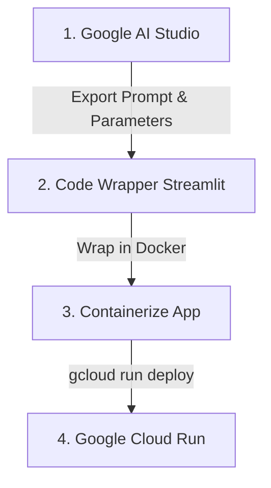

# 🚀 Hackathon Guide: Track A (Rapid Application Prototyping)

Welcome to Track A! This guide outlines the exact, step-by-step workflow to go from a prompt in **Google AI Studio** to a live, hosted web application on **Google Cloud Run** using **Vertex AI**.

---

## 🗺️ The Workflow at a Glance



---

## 🛠️ Step 1: Design your Prototype in Google AI Studio

Google AI Studio is your prototyping workbench. This is where you refine your prompt logic before writing code.

1. **Go to AI Studio**: Open [aistudio.google.com](https://aistudio.google.com) and sign in.
2. **Choose Your Model**:
   - Use `Gemini 1.5 Flash` (highly recommended for rapid prototyping; it's lightning-fast and cost-effective).
   - Use `Gemini 1.5 Pro` if your prototype requires deep reasoning or massive context windows.
3. **Write System Instructions**: Define the persona and rules. For example:
   > *"You are an assistant that summarizes user feedback into key action items for product managers. Group them by feature area."*
4. **Test the Prompts**: Use the input box to test inputs and tune parameters (e.g., lower temperature for structured outputs, higher temperature for creative ones).
5. **Get Code**: Click **"Get Code"** in the top right.
   - Note the **System Instructions** and the **Prompt structure**—we'll use this in our Python application.

---

## 🐍 Step 2: Build the Frontend (Streamlit + Vertex AI)

To deploy to Cloud Run, your prototype needs a web interface. **Streamlit** is a Python library that lets you build web interfaces in pure Python in minutes.

We will use the **Vertex AI SDK** (`google-cloud-aiplatform`) to call Gemini, which is the enterprise-grade version of Google AI Studio.

### 1. Requirements File (`requirements.txt`)
Create a file named `requirements.txt` to define the dependencies:
```text
streamlit>=1.35.0
google-cloud-aiplatform>=1.50.0
protobuf>=4.25.0
```

### 2. Streamlit App (`app.py`)
Create a file named `app.py`. This script sets up a simple, clean UI and calls Gemini via Vertex AI:

```python
import os
import streamlit as st
import vertexai
from vertexai.generative_models import GenerativeModel, SafetySetting

# 1. Initialize Vertex AI
# When deploying to Cloud Run, the project ID and location are automatically inferred 
# or can be read from environment variables.
PROJECT_ID = os.environ.get("GCP_PROJECT", "your-gcp-project-id") # Fallback to local testing project ID
LOCATION = os.environ.get("GCP_LOCATION", "us-central1")

vertexai.init(project=PROJECT_ID, location=LOCATION)

# 2. Configure the Page
st.set_page_config(
    page_title="Rapid AI Prototype",
    page_icon="🚀",
    layout="centered"
)

# Custom Styling (WOW factor!)
st.markdown("""
    <style>
    .main {
        background: linear-gradient(135deg, #1e1e2f 0%, #11111d 100%);
        color: #ffffff;
    }
    h1 {
        background: linear-gradient(to right, #4facfe 0%, #00f2fe 100%);
        -webkit-background-clip: text;
        -webkit-text-fill-color: transparent;
        font-family: 'Outfit', sans-serif;
    }
    .stButton>button {
        background: linear-gradient(135deg, #667eea 0%, #764ba2 100%);
        color: white;
        border: none;
        border-radius: 8px;
        padding: 10px 24px;
        font-weight: bold;
        transition: transform 0.2s;
    }
    .stButton>button:hover {
        transform: scale(1.05);
    }
    </style>
""", unsafe_allow_html=True)

# Title
st.title("🚀 Rapid AI Prototype")
st.write("Powered by Vertex AI & Gemini 1.5 Flash")

# User Input
user_input = st.text_area(
    "Enter your input text:",
    placeholder="Type something here...",
    height=150
)

# Generate Button
if st.button("Generate Response"):
    if not user_input.strip():
        st.warning("Please enter some input text.")
    else:
        with st.spinner("Gemini is thinking..."):
            try:
                # 3. Load the Model with System Instructions from AI Studio
                model = GenerativeModel(
                    "gemini-1.5-flash-001",
                    system_instruction=[
                        "You are a helpful hackathon prototype assistant.",
                        "Provide structured, clear, and action-oriented responses."
                    ]
                )
                
                # 4. Generate Content
                response = model.generate_content(
                    user_input,
                    generation_config={
                        "temperature": 0.4,
                        "max_output_tokens": 1024,
                    }
                )
                
                # 5. Display Result
                st.success("Generation Complete!")
                st.subheader("Output:")
                st.markdown(response.text)
                
            except Exception as e:
                st.error(f"Error calling Vertex AI: {e}")
```

---

## 📦 Step 3: Containerize the Application

Google Cloud Run deploys **containers**. We need a `Dockerfile` to package our Python app.

Create a file named `Dockerfile` in the same directory:
```dockerfile
# Use lightweight python image
FROM python:3.11-slim

# Set working directory
WORKDIR /app

# Copy requirements and install
COPY requirements.txt .
RUN pip install --no-cache-dir -r requirements.txt

# Copy application files
COPY app.py .

# Expose Streamlit default port
EXPOSE 8501

# Run the application
ENTRYPOINT ["streamlit", "run", "app.py", "--server.port=8501", "--server.address=0.0.0.0"]
```

---

## 🚀 Step 4: Deploy to Google Cloud Run

We can build and deploy the container in one go using the Google Cloud CLI (`gcloud`).

### Command Checklist (Terminal):

1. **Log in to Google Cloud:**
   ```bash
   gcloud auth login
   ```
2. **Set your Google Cloud Project ID:**
   ```bash
   gcloud config set project YOUR_PROJECT_ID
   ```
3. **Enable Required APIs:**
   ```bash
   gcloud services enable run.googleapis.com \
                          artifactregistry.googleapis.com \
                          cloudbuild.googleapis.com \
                          aiplatform.googleapis.com
   ```
4. **Deploy Directly from Source:**
   Run this command in the directory containing `app.py`, `Dockerfile`, and `requirements.txt`:
   ```bash
   gcloud run deploy hackathon-prototype \
       --source . \
       --region us-central1 \
       --allow-unauthenticated \
       --set-env-vars GCP_PROJECT=YOUR_PROJECT_ID,GCP_LOCATION=us-central1
   ```

*(Note: Cloud Run will automatically package your application using Cloud Build and deploy it to a live public URL!)*

---

## 💡 Pro-Tips for Track A Judges (Winning Hacks)

1. **Focus on UX/UI First Impressions**: Judges love beautiful prototypes. Spend 20% of your time styling your Streamlit app with CSS (fonts, colors, hover transitions) or use a modern Streamlit theme.
2. **Handle Errors Gracefully**: Always wrap your API calls in `try/except` blocks so the UI doesn't crash if the API fails.
3. **Service Accounts**: Make sure your Cloud Run service has the **Vertex AI User** role in IAM so it can make API calls securely without managing key files.
